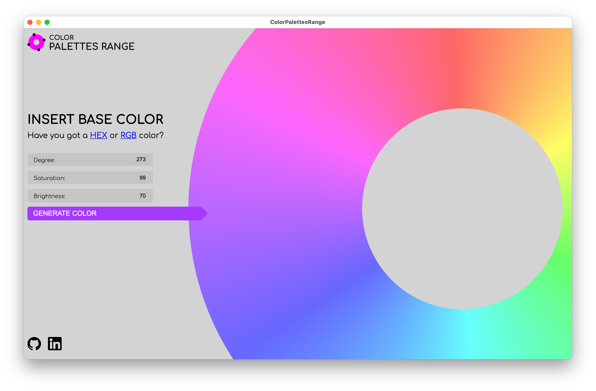
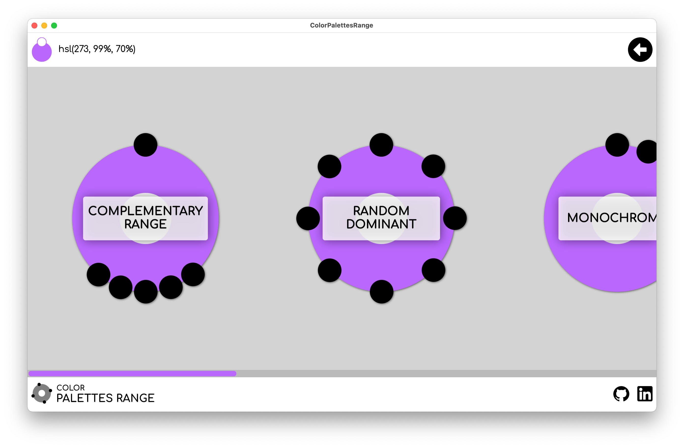
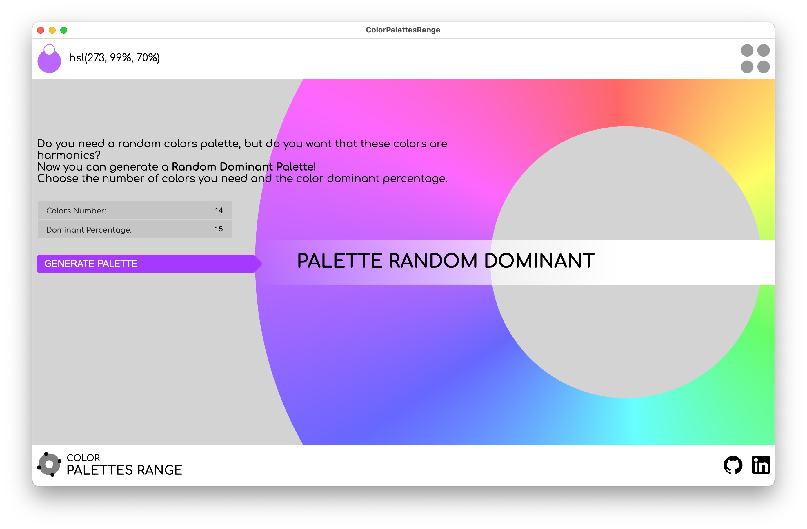
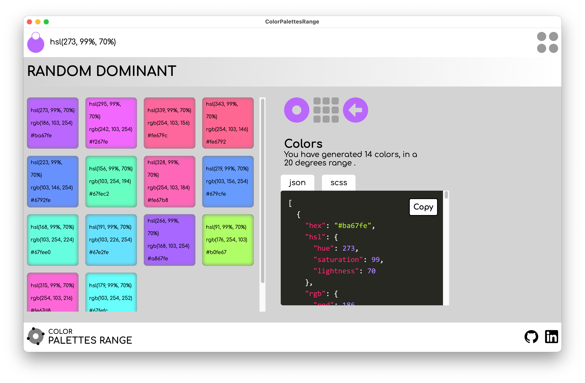
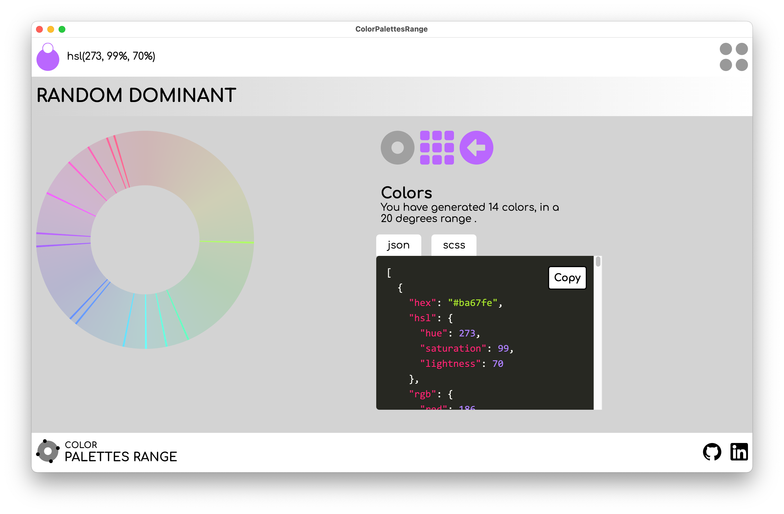

# Color Palettes Range
#### v 0.1.0
## Are you bored with classic color palettes?  
Now you can generate more than three or five colors palette: take a **Complementary Palette** or a **Random Dominant Palette**, and you can decide how many colors you want!  
 
You can copy a single color in HSL, RGB, HEX format, or your single palette in JSON or SCSS formats.

---
This App is developed in VueJS/Electron and is based on my npm package **Color Palettes Range**
https://www.npmjs.com/package/@chiarapassaro/color-palettes-range

## Make Electron App 
**Mac** `electron-forge make --platform=darwin` 
**Windows** `electron-forge make --platform=win32`

## "Making of" Articles (Italian)
* [Creiamo una app con Vue ed Electron](https://chiarapassaro.medium.com/creiamo-una-app-con-vue-ed-electron-1-parte-147209265616)

* [Creiamo una app con Vue ed Electron Parte 2](https://chiarapassaro.medium.com/creiamo-una-app-con-vue-ed-electron-parte-2-a12a0fc62df1)

* [Creiamo una app con Vue ed Electron Parte 3](https://chiarapassaro.medium.com/creiamo-una-app-con-vue-ed-electron-parte-3-46aa10391e03)

* [Creiamo una app con Vue ed Electron Parte 4](https://chiarapassaro.medium.com/creiamo-una-app-con-vue-ed-electron-parte-4-db0a9133b8b0)

* [Creiamo una app con Vue ed Electron Parte 5](https://chiarapassaro.medium.com/creiamo-una-app-con-vue-ed-electron-parte-5-4a5e67d0b8e1)

* [Creiamo una app con Vue ed Electron Parte 6](https://chiarapassaro.medium.com/creiamo-una-app-con-vue-ed-electron-parte-6-7c9a19a71bea)

## Screens

